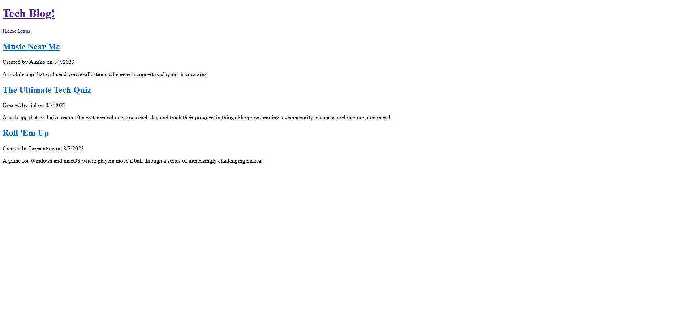

# mvc-tech-blog
Tech Blog made using Model-view control paradigm

## Description
Main Topic: Model-view control (MVC)

Blog that allows for a user to sign in and create a new blog for the site. Other users can see the new blog post on the front page and save/comment on the new blog post. This app uses Handlebar.js expression and helpers to implement the front end while Sequelize and MySQL handle the backend. Using the Controller to mediate the view and model by processiong request for data.


## Screenshot



## Link
[Click here]()


## Developed by:
```
John Foxwell
```

